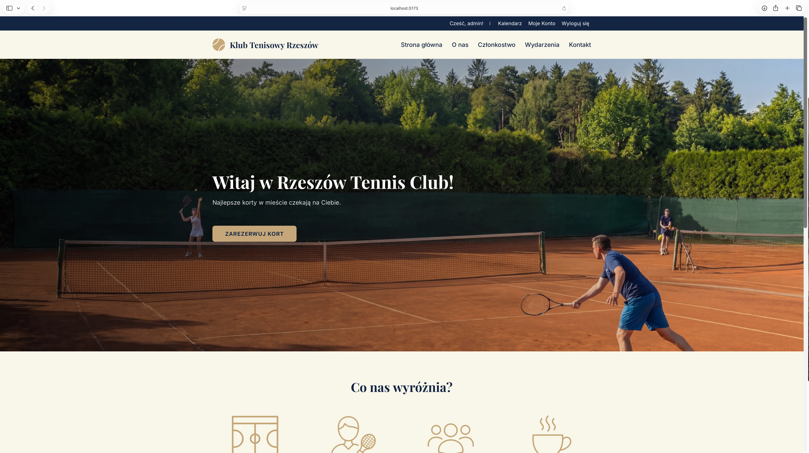
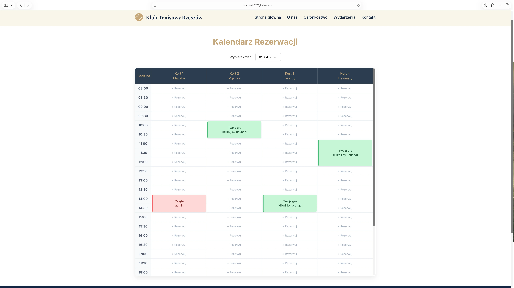
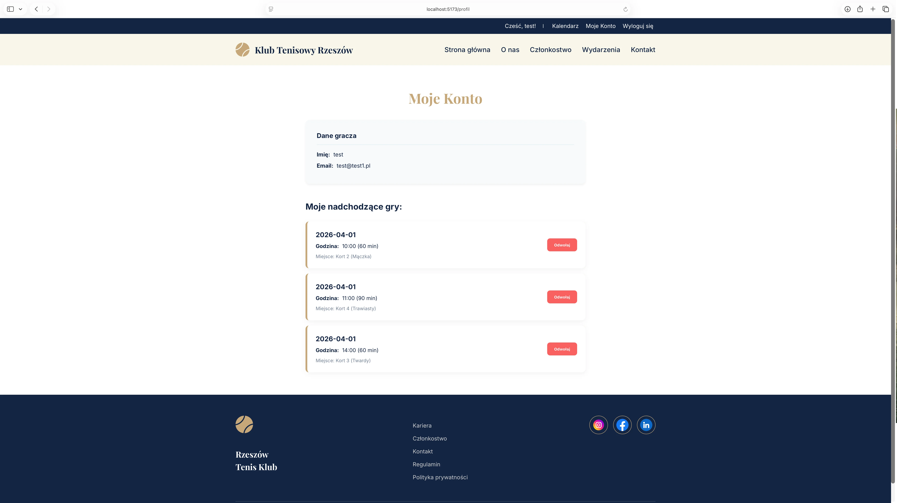

Rzeszów Tennis Club - Booking System

Aplikacja webowa typu Full-Stack (SPA) umożliwiająca przeglądanie oferty klubu tenisowego oraz rezerwację kortów w czasie rzeczywistym. Projekt stworzony w ramach portfolio.

Technologie

- Frontend: React (Vite), React Router v6, CSS (Grid/Flexbox)
- Backend: Node.js, Express.js
- Baza Danych: PostgreSQL, Prisma ORM
- Autoryzacja: JSON Web Tokens (JWT), Bcrypt

Główne funkcjonalności

- Rejestracja i logowanie użytkowników (JWT).
- Podział na role (User/ Admin)
- Interaktywny kalendarz zbudowany natywnie w CSS Grid.
- Algorytm backendowy zapobiegający nakładaniu się rezerwacji.
- Elastyczny czas gry (60 min lub 90 min)
- Zarządzanie własnymi rezerwacjami, tworzenie oraz anulowanie.
- Spersonalizowany panel gracza, dedykowany profil („Moje Konto”) prezentujący pełną historię rezerwacji użytkownika
- Rozszerzony panel Administratora: Automatyczne wyświetlanie szczegółowych danych osoby rezerwującej (imię, nazwisko oraz numer telefonu) bezpośrednio w widoku kalendarza z poziomu konta administratora.

Zrzuty ekranu

Strona Główna

Kalendarz Rezerwacji

Profil Gracza ("Moje Konto")

Plany na przyszłość / Znane braki

Z racji ograniczeń czasowych związanych z bieżącymi obowiązkami na studiach, projekt jest w fazie MVP. Najważniejsze kroki do wdrożenia to:

- Pełne wsparcie RWD
- Nowoczesne powiadomienia
- Zabezpieczenie endpointów chronionych
- Powiadomienia E-mail
- Integracja płatności
